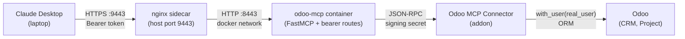

# Odoo MCP Server

Bearer-auth MCP server for Giggso teams to query and modify Odoo via Claude Desktop.

Every tool call runs under the requesting user's Odoo identity — not a service account.
`with_user(real_user)` ensures Odoo's own permission system enforces what each person can see or change.

---

## Architecture



- nginx terminates TLS; the MCP container is not exposed to the host network
- The Odoo addon verifies the connector signing secret before executing any ORM call
- Every action is logged to `/var/log/odoo-mcp/audit.jsonl`

---

## One-command deploy

Run on the OCI box as the `opc` user (sudo required for docker and systemctl):

```bash
sudo MCP_FRONTEND_MODE=nginx \
     MCP_PUBLIC_URL=https://odoo.giggso.com:9443/mcp \
     ODOO_URL=https://odoo.giggso.com \
     ODOO_DB_NAME=odoo-prod \
     IDENTITY_ISSUER=https://accounts.google.com \
     IDENTITY_JWKS_URL=https://www.googleapis.com/oauth2/v3/certs \
     IDENTITY_AUDIENCE=odoo-mcp \
     MCP_NGINX_CERT_DIR=/home/opc/gg-odoo-app/domaincert \
     bash scripts/install_odoo_mcp.sh
```

After the installer finishes, complete the Odoo side:

1. Apps menu -> Update Apps List
2. Install: **Odoo MCP Connector**
3. Settings -> Technical -> Parameters -> System Parameters
4. Create or update: `odoo_mcp_connector.signing_secret` = (value printed by installer)

Verify the deploy:

```bash
curl -k https://odoo.giggso.com:9443/mcp/auth/whoami
# expected: HTTP 401 {"detail": "Authorization header missing"}
```

---

## Claude Desktop setup

See [docs/clients/claude-desktop.md](docs/clients/claude-desktop.md) for the full
4-step walkthrough: open OCI firewall port, mint a bearer token, edit the Claude
config file, smoke-test.

---

## Per-user identity

The Odoo MCP Connector maps every inbound bearer token to a real `res.users` record.
All ORM calls execute as `env.with_user(real_user)` — Odoo's record rules and access
control lists apply. The server does not expose a superuser path.

---

## Operator runbook

Daily ops (token issuance, revocation, log tailing, cert rotation) are in
[docs/operator-runbook.md](docs/operator-runbook.md).

---

## Architecture decisions

Three ADRs covering bearer auth, nginx sidecar, and the internal-first roadmap are in
[docs/architecture.md](docs/architecture.md).

---

## Roadmap

See [ROADMAP.md](ROADMAP.md) for the next three delivery cycles (token self-service,
group-based permissions, Google Workspace identity integration).
