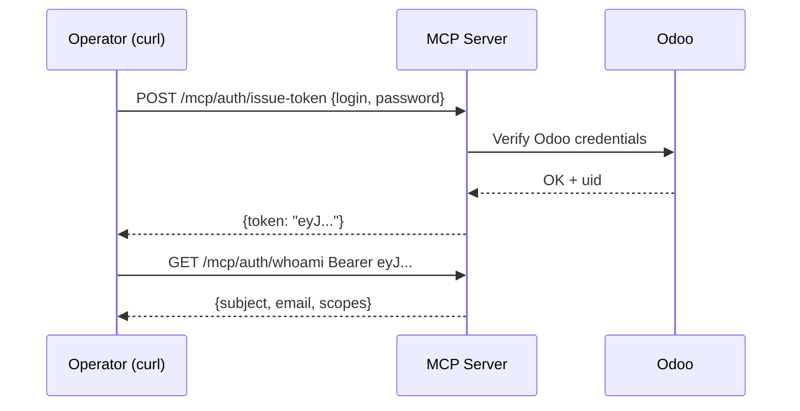
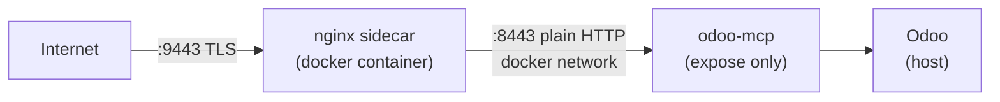

# Architecture Decisions — Odoo MCP Server

Three ADRs capturing the key choices made during Cycle 2 deployment.

---

## ADR-001: Bearer-token authentication (Cycle 2)

**Status:** Adopted

**Context:** MCP clients need to authenticate to the server. Two options were evaluated:

- **Option B — Bearer tokens**: Server-issued JWTs, verified locally against a
  signing secret. Zero external dependencies. Works with any HTTP client including
  Claude Desktop.
- **Option C — OAuth 2.1**: Full authorization-server flow (Google/Okta/Entra).
  Provides token revocation, short-lived access tokens, and enterprise SSO
  out of the box. But requires an authorization server or a full OIDC library.

**Decision:** Option B (bearer tokens) for Cycle 2.

**Rationale:** Claude Desktop cannot drive a browser-based OAuth flow today.
Bearer tokens issued via `/auth/issue-token` work immediately without additional
infrastructure. Option C is the target state and is planned for Cycle 5 (Google
Workspace identity integration).

---

## ADR-002: nginx sidecar on host port 9443

**Status:** Adopted

**Context:** The Odoo MCP server needs to serve HTTPS to Claude Desktop.

Options considered:

1. Terminate TLS inside uvicorn (Cycle 1 default) — publishes host port :8443.
2. Route through the existing host nginx on :443 — requires touching production
   nginx config, risky.
3. Add a dedicated nginx sidecar container on a different port.

**Decision:** Option 3 — nginx sidecar on host port 9443.

**Rationale:**
- Host nginx (port 443) is not touched; no production risk.
- The MCP container uses `expose:` instead of `ports:`, keeping it off the host
  network entirely. Only the sidecar is reachable from outside.
- Port 9443 avoids collision with both :443 (host nginx) and :8443 (legacy MCP
  direct-mode publish).

---

## ADR-003: Giggso internal-first roadmap

**Status:** Adopted

**Context:** Should the MCP server be built as a multi-tenant product or
internal-first tooling?

**Decision:** Internal-first. Giggso staff are the only users for now.

**Rationale:**
- Multi-tenant adds auth complexity (per-tenant secrets, isolation, billing)
  before the core flow is validated.
- Internal use gives fast feedback from real Odoo workflows.
- The codebase does not prevent multi-tenant later; it just does not assume it.
- Marketplace or external distribution is explicitly out of scope until the
  internal deployment is stable and the value is proven.
