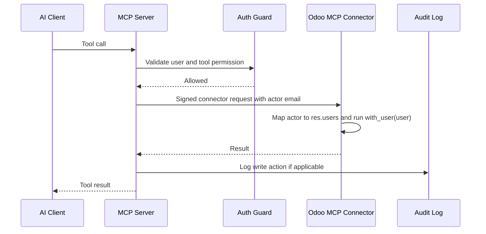

# Odoo MCP Server Implementation Outline

## Proposed Repository Structure

```text
odoo_mcp_server/
├── pyproject.toml
├── README.md
├── Dockerfile
├── docker-compose.example.yml
├── .env.example
├── src/
│   └── odoo_mcp/
│       ├── server.py
│       ├── config.py
│       ├── odoo_client.py
│       ├── auth.py
│       ├── audit.py
│       ├── permissions.py
│       └── tools/
│           ├── crm.py
│           ├── projects.py
│           ├── activities.py
│           └── admin.py
└── tests/
    ├── unit/
    └── integration/
```

## Configuration

`.env` should exist only on the deployment server.

```text
ODOO_URL=https://odoo.example.com
ODOO_MCP_CONNECTOR_SECRET=replace-with-shared-connector-signing-secret
ODOO_MCP_IDENTITY_ISSUER=https://idp.example.com
ODOO_MCP_IDENTITY_AUDIENCE=odoo-mcp
ODOO_MCP_IDENTITY_JWKS_URL=https://idp.example.com/.well-known/jwks.json
ODOO_MCP_HOST=127.0.0.1
ODOO_MCP_PORT=8088
ODOO_MCP_PUBLIC_URL=http://127.0.0.1:8088
AUDIT_LOG_PATH=/var/log/odoo-mcp/audit.jsonl
```

Do not store Odoo passwords or API keys in Git.

## Runtime Flow



## Permission Rules

- User must have a valid signed identity token from the SSO gateway.
- User email must map to an active Odoo user.
- Odoo must permit the requested operation through native ACLs and record rules.
- Write tools must log audit events.
- Destructive actions are disabled in MVP.

## Docker Compose Example

```yaml
services:
  odoo-mcp:
    image: company/odoo-mcp:latest
    restart: unless-stopped
    env_file:
      - .env
    ports:
      - "127.0.0.1:8088:8088"
    volumes:
      - ./audit:/var/log/odoo-mcp
```

The MCP server listens on `ODOO_MCP_HOST:ODOO_MCP_PORT` inside the container. For Docker, set `ODOO_MCP_HOST=0.0.0.0` and keep the host-side published port bound to `127.0.0.1` or an authenticated reverse proxy.

If the service must be reached by remote clients, put it behind an authenticated HTTPS reverse proxy instead of binding it directly to the public internet.
