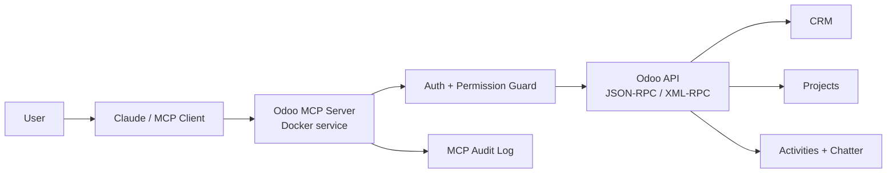
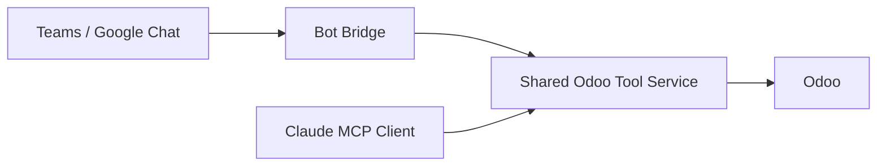
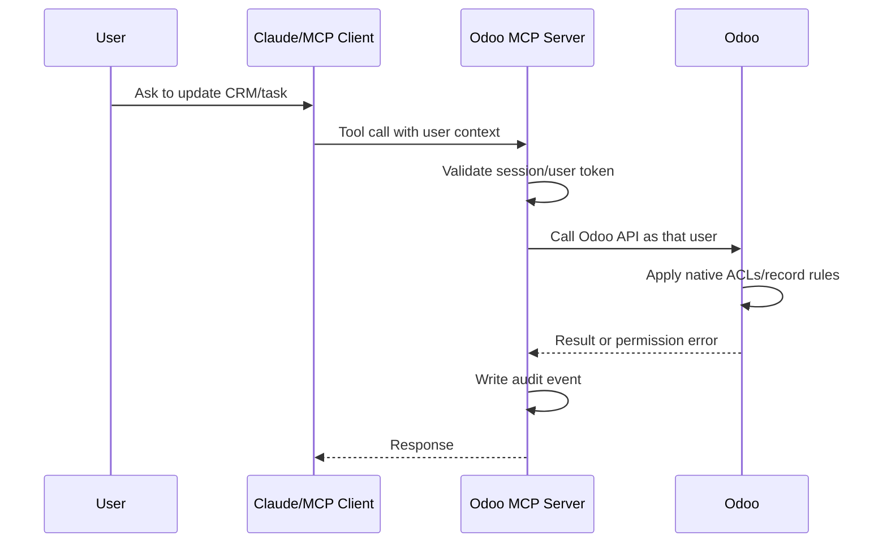

# Odoo MCP Connector - WBS and Delivery Plan

## 1. Executive Goal

Build a secure MCP integration for open source Odoo so authorized users can work with Odoo CRM and Odoo Projects from Claude first, then from Microsoft Teams, Google Chat, or other chat surfaces.

The first production target is a Docker-deployed MCP server running near the Odoo server. Each human user must authenticate with their own identity and only perform actions allowed by their Odoo permissions and the installed Odoo connector module.

## 2. Product Scope

### In Scope

- Odoo CRM tools.
- Odoo Projects and Kanban/task tools.
- Per-user access model.
- Odoo module access control.
- Docker deployment on the Odoo server or same private network.
- Audit logging for write actions.
- Marketplace-ready Odoo connector module.
- Monetization plan.

### Out of Scope for MVP

- Odoo HR, Accounting, Payroll, and Inventory.
- Public internet exposure without authentication.
- Generic unrestricted Odoo model writes.
- Marketplace publishing before internal production validation.
- Teams and Google Chat production bots before the Claude MCP flow is stable.

## 3. Target Architecture



Future chat integrations reuse the same Odoo service layer:



## 4. Deployment Model

### MVP Deployment

```text
Odoo server or same private network
├── existing Odoo service
├── PostgreSQL used by Odoo
└── odoo-mcp-server Docker container
```

The MCP server should connect to Odoo through the official Odoo API. It should not connect directly to the Odoo PostgreSQL database.

### Production Runtime Requirements

- Docker or Docker Compose.
- Private network access to Odoo.
- TLS if remote clients connect over HTTPS.
- Secret storage through environment variables or server secret manager.
- No credentials committed to the repository.
- Health check endpoint.
- Structured logs.
- Audit log persistence.

## 5. Login and Access Model

### Required Access Principle

Every user must act as themselves. A user must not be able to update Odoo as another user unless Odoo itself allows delegation.

### Preferred Production Model



### Access Options

| Option | Use Case | Pros | Cons | Recommendation |
|---|---|---|---|---|
| Per-user Odoo API key | Production | Native Odoo permissions and user attribution | Requires token onboarding and secure storage | Best target |
| Company SSO mapped to Odoo user | Later enterprise version | Best UX, centralized identity | More complex | Phase 2 |
| Service account | Prototype only | Fast setup | Weak attribution unless audit logs map user separately | Avoid for production writes |

## 6. Odoo Marketplace Strategy

The marketplace artifact should be an Odoo addon, not the entire MCP runtime.

```text
odoo_mcp_connector/
├── __init__.py
├── __manifest__.py
├── controllers/
├── models/
├── security/
├── views/
├── static/description/
└── doc/
```

The addon should provide:

- Enable/disable MCP connector.
- Allowed user groups.
- CRM and Projects access toggles.
- Token or connection registration.
- Audit log menu.
- Documentation and setup guide.
- Optional webhook endpoints for bot integrations.

The external Docker MCP server remains separately deployed by the customer or by the vendor as a managed service.

## 7. Work Breakdown Structure

| WBS | Work Package | Deliverables | Exit Criteria |
|---|---|---|---|
| 1.0 | Discovery and constraints | Odoo version, deployment topology, user roles, CRM/Project workflows | Reviewed discovery checklist |
| 2.0 | Architecture | Architecture diagrams, ADRs, threat model, data flow | Approved architecture pack |
| 3.0 | Odoo API adapter | Auth client, JSON-RPC/XML-RPC wrapper, model allowlist | Can read CRM and Project data from staging |
| 4.0 | MCP server foundation | MCP server scaffold, config, logging, health check | Local MCP client can connect |
| 5.0 | CRM tools | Search leads, create lead, update stage, add note, schedule activity | CRM smoke tests pass |
| 6.0 | Project tools | List projects, list tasks, create task, move stage, assign, comment | Project smoke tests pass |
| 7.0 | Auth and permissions | Per-user auth, group checks, Odoo ACL enforcement | Unauthorized user blocked |
| 8.0 | Audit and governance | Write audit log, dangerous action confirmation, no-delete defaults | Audit events visible |
| 9.0 | Docker deployment | Dockerfile, compose file, env template, deployment guide | Runs on staging server |
| 10.0 | Test strategy | Unit tests, integration tests, staging UAT checklist | Test report reviewed |
| 11.0 | Odoo connector addon | Marketplace module with settings, groups, audit views | Installs in staging Odoo |
| 12.0 | Marketplace readiness | Manifest, icon, screenshots, docs, license, pricing metadata | Submission package ready |
| 13.0 | Monetization | Pricing tiers, support model, licensing posture | Go-to-market plan approved |
| 14.0 | Production rollout | Server access, deploy, monitor, rollback plan | Production signoff |

## 8. Development Phases

### Phase 1 - Internal MVP

- Build MCP server.
- Support CRM and Projects read tools.
- Add limited write tools.
- Deploy with Docker to staging.
- Validate with a small internal user group.

### Phase 2 - Secure Production

- Add per-user Odoo auth.
- Add stronger audit logging.
- Add permission and group validation.
- Deploy beside production Odoo.
- Run UAT and production readiness review.

### Phase 3 - Marketplace Package

- Build Odoo addon for connector setup and audit visibility.
- Prepare marketplace documentation and screenshots.
- Publish as free, paid, or freemium depending on monetization decision.

### Phase 4 - Chat Integrations

- Add Teams bot bridge.
- Add Google Chat bridge.
- Add slash commands and action confirmations.

## 9. Initial Tool Inventory

### CRM MCP Tools

- `crm_search_opportunities`
- `crm_get_opportunity`
- `crm_create_lead`
- `crm_update_stage`
- `crm_add_note`
- `crm_schedule_activity`
- `crm_list_stale_opportunities`
- `crm_list_stages`

### Project MCP Tools

- `project_list_projects`
- `project_list_tasks`
- `project_get_task`
- `project_create_task`
- `project_move_task_stage`
- `project_list_task_stages`
- `project_assign_task`
- `project_add_comment`
- `project_daily_summary`

### Admin MCP Tools

- `odoo_health_check`
- `odoo_get_current_user`
- `odoo_list_allowed_capabilities`
- `odoo_audit_recent_actions`

## 10. Security Guardrails

- No direct database writes.
- No generic unrestricted write tool.
- No HR/accounting access in MVP.
- No secrets in Git.
- Per-user tokens stored outside source control.
- Destructive actions disabled by default.
- All writes audited.
- Odoo ACLs and record rules remain the source of truth.
- Docker container runs as non-root user.
- Public exposure requires authenticated HTTPS gateway.

## 11. Deployment Checklist

- Confirm Odoo version.
- Confirm staging Odoo URL and database name.
- Create least-privilege test users.
- Configure API keys for test users.
- Create `.env` on server, not in Git.
- Build Docker image.
- Run container on private network.
- Validate health check.
- Validate CRM read/write.
- Validate Project read/write.
- Validate unauthorized access denial.
- Review logs and audit records.
- Prepare rollback: stop container and revoke tokens.

## 12. Marketplace Checklist

- Odoo module technical name selected.
- `__manifest__.py` complete.
- License chosen.
- `security/ir.model.access.csv` present.
- Settings views complete.
- Audit views complete.
- `static/description/icon.png` present.
- `static/description/index.html` complete.
- Screenshots prepared.
- External service requirement clearly disclosed.
- Privacy/data movement clearly disclosed.
- Support email defined.
- Pricing model selected.

## 13. Monetization Options

| Model | Description | Best For |
|---|---|---|
| Paid Odoo app | One-time marketplace purchase per Odoo version | Simple sales motion |
| Free connector + paid hosted MCP | Marketplace app is free, revenue from hosted service | Recurring revenue |
| Open core | Free CRM/Project basics, paid Teams/Google Chat/SSO | Adoption plus upsell |
| Enterprise support | Customer self-hosts, pays for support and updates | Security-conscious companies |

Recommended path:

1. Internal working product.
2. Free or low-cost marketplace connector.
3. Paid managed MCP hosting and enterprise support.
4. Paid add-ons for Teams, Google Chat, SSO, advanced audit, and workflow automation.

## 14. Immediate Next Decisions

- Odoo version.
- Self-hosted deployment details.
- Preferred MCP framework.
- Per-user API key flow.
- Whether marketplace addon should be free, paid, or open core.
- Whether Teams/Google Chat are Phase 2 or Phase 4.
